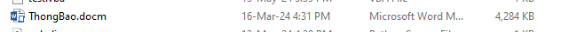

# Writeup KCSC-CTF-2024

## Forensic

### Chall3 - Jumper In Disguise

#### Phân tích sơ qua... 

- File sau khi giải nén là file .docm -> đây thường là dạng bài file doc có gắn marco vì thế tư duy đầu tiên mn hay là sẽ là dùng **olevba** để dump đoạn marco ra.

Mình cũng làm như vậy ...

Sau khi đọc qua thì thấy là khi người dùng ấn allow cho chạy script marco thì sẽ hiện messagebox kèm flag giả :v 

Đoạn dưới thì thực hiện tách binary ở đâu đó ra -> giải mã XOR với key là bbb 

:v một điều mình chưa giải thích đc là khi **olevba**  thì *bbb = 4444* 

Còn khi mình làm theo hướng mở file lên thì bbb=1337 

Có lẽ đây là một trick gì đó của tác giả :v Thật là hay mà

- Một điều nữa khi tải về mình kiểm tra thấy kích thước file nặng khá bất thường -> có lẽ đã được nhúng thêm gì đó đính kèm rồi :v

- Nhanh tay chuyển sang dạng zip rồi giải nén ra 

- kích thước cái ảnh đúng 4.16MB :)) quá bất thường cho một con ảnh -> HXD xem như nào .... 

Nhưng mà trong lúc thi nên mình sẽ chọn cách nhanh hơn :))  *(Chút nữa quay lại phân tích script VBA sau)*

Trong lúc thi thường lú lắm nên mình sẽ chọn cách chạy docm trên máy ảo để lấy file exe luôn.

- Kết hợp đọc qua code mình biết được vị trí file exe sẽ được lưu ra 

- dễ dàng tìm được chỗ lấy EXE về nghịch tiếp mà không tốn sức đọc vba decode .... 

#### Phân tích file thực thi Acheron

Nhìn qua là biết e nó viết bằng python rồi, quá đơn giản ròi 

Dùng **pyinstxtractor** trích pyc ra thôi

https://github.com/extremecoders-re/pyinstxtractor/blob/master/pyinstxtractor.py

- Code được viết bằng python3.7, file chính là file lmao.pyc . Chỉ lưu ý là chỗ version này extract ra không để ý là hay lỗi và cách bước sau không lấy được code...
- Đến đây có thể dùng nhiều cách. Lười thì up lên **decompiler**

https://www.decompiler.com/jar/4b750a9863b5479d9c0c1c7e40736b9c/lmao.py

- Mà chăm hơn thì **Uncompyle6**

- Chăm nữa thì **pycdc**

- Đường cùng thi **pycdas**

nói chung là python là không sợ :))

- Đọc code python thoi. Cũng không phức tạp lắm.

Giờ cần lấy được key của RC4 ở sys.argv[1] 

Phải dở code VBA ra đọc lại rồi

- Gọi tên file + nifal

- nifal thì sau cái hàm zzz gì gì kia 

:)) làm theo cách người lười thoi

- Sức mạnh của AI chưa :3

sửa cái xor_key thành 1337 là có key rồi 

=> **"Kyoutei saitaku, shoudou sakusen jikkou!!!"**

- *Còn một cách dành cho người lười nữa là sửa trên vba xong chạy trên sample luôn*

 

- Còn 4 cái bytes của file EXE thì dễ, cứ mở HXD lên copy thôi

- rồi giờ sửa lại cái code gốc một tí cho nó in ra 

- Thấy luôn flag ở đây rồi 

>  KCSC{I_@m_daStomp_dat_1z_4Ppr0/\ch1n9!}

:)) Bài học rút ra là gì ? => Hãy lười đừng chăm chỉ quá 

#### Quay lại phân tích VBA (rảnh xem lại sau)

............... đang lười lắm ..............

### Chall1- Externet Inplorer

Bài này khá dễ . Dùng tool parse thời gian ra luôn https://dfir.blog/unfurl/

**2023-09-18 08:32:22.547027**

## Reverse

## f@k3

